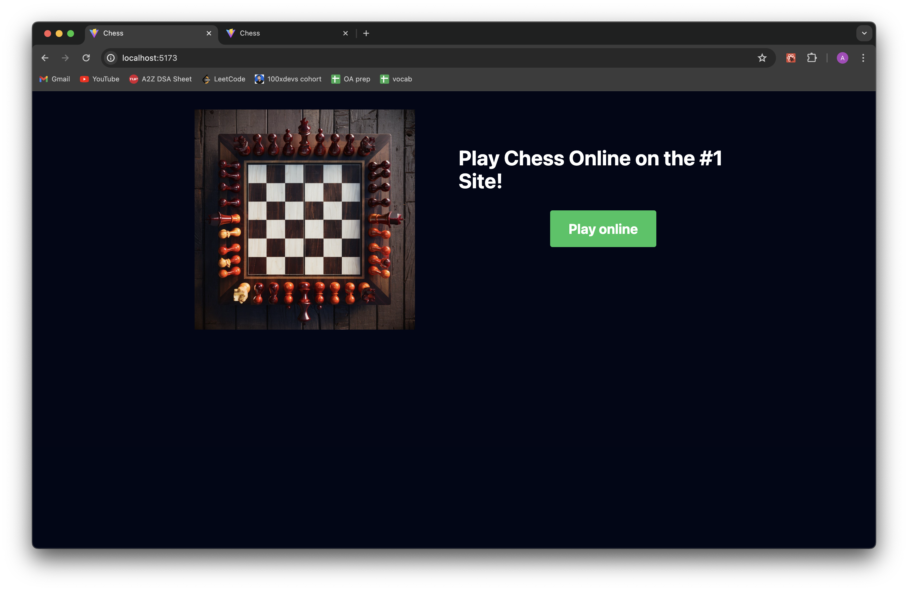
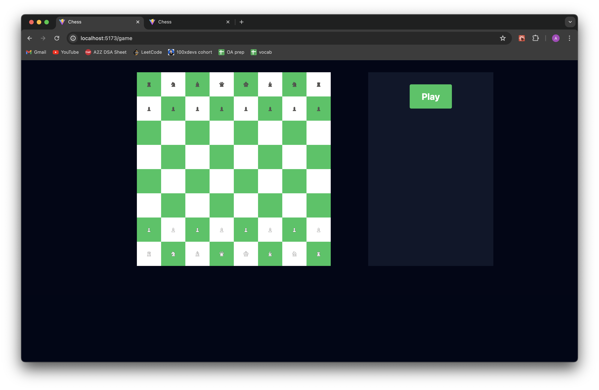
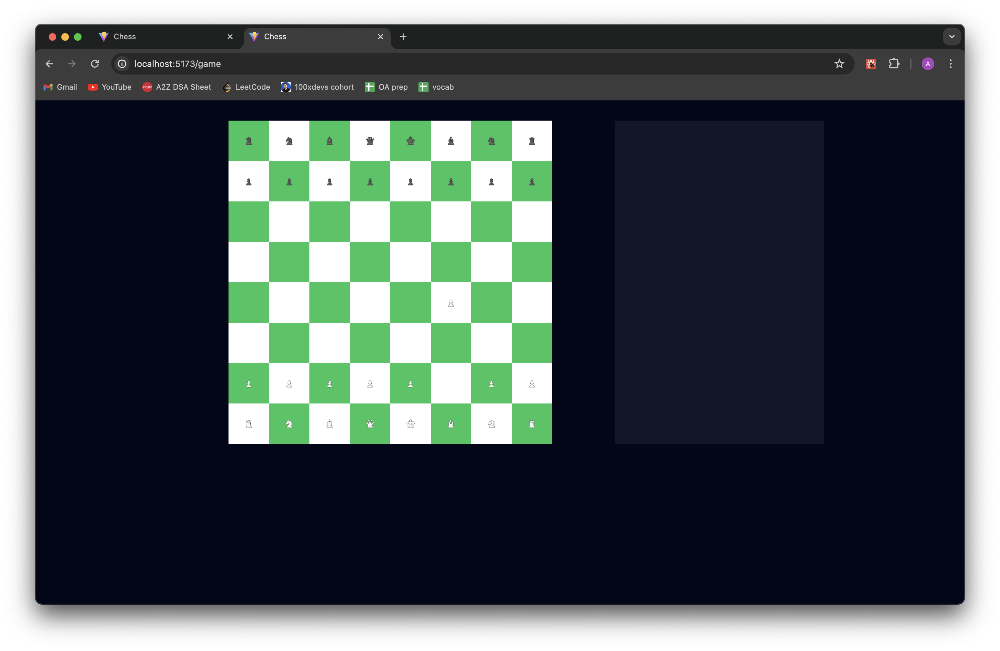
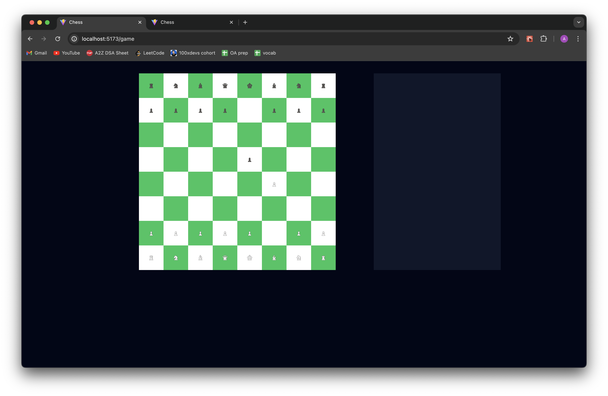
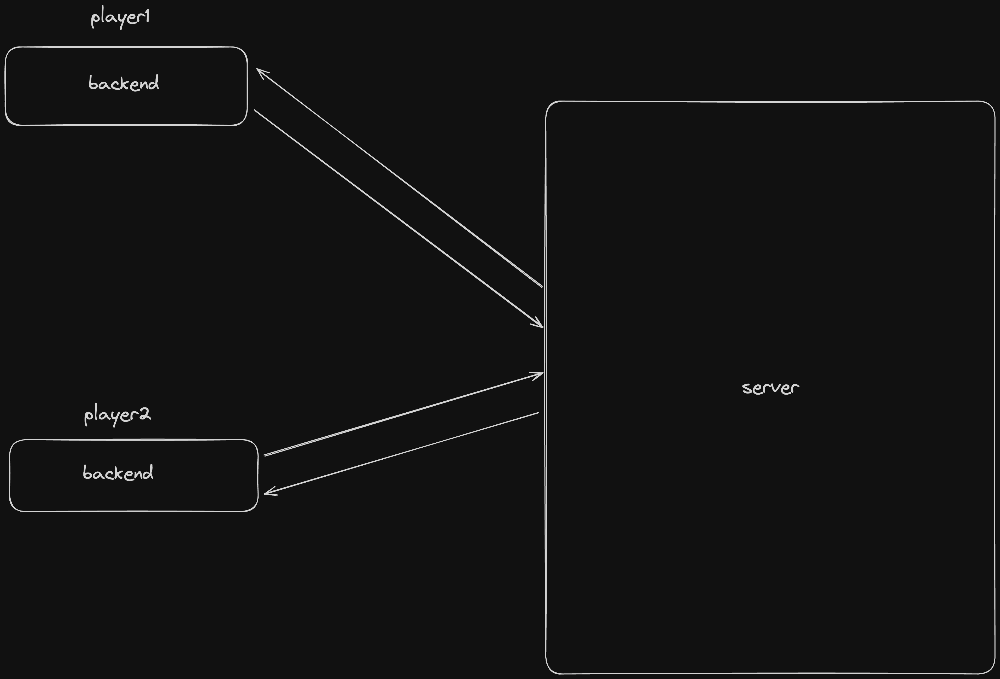

# Chess

This is a web-based chess application built using web sockets for real-time gameplay. Players can connect to the application and play chess against each other, with moves being updated in real time.

## Screenshots

### Consider the first tab as Player1(White) and second tab as Player2(Black)

### Play Online

### Play Player1(White)

- Only after another user comes online then it can played, the Player2(Black) also goes online
### Move made by Player2(White)

- Move made by white player
### Move made by Player2(Black)

- Move made by black player
### Move made by Player2(Black) updated on Player1(White) page

- Move made by black player and that also gets updated on white players web page

### System Architecture

## Features

- **Real-time Gameplay:** Play chess against other players with moves being updated in real time.
- **WebSocket Communication:** Use web sockets to enable real-time communication between players.
- **Responsive Design:** The application is designed to work well on both desktop and mobile devices.

## Technologies Used

- **Frontend:** React.js, TailwindCSS
- **Backend:** Node.js, WebSockets
- **WebSockets Library:** WS
- **Other Libraries:** Chess.js

## Installation

To run the application locally, follow these steps:

1. Clone the repository: `git clone https://github.com/aadarsharma/chess.git`
2. Install dependencies: `npm install`
3. Starting the backend: `cd backend1`
4. Build the project: `tsc -b`
5. Run the backend: `node dist/index.js`
6. Starting the frontend: `cd frontend`
7. Access the project locally: `npm run dev`
8. Access the application in your browser at `http://localhost:5137`

## Usage

1. Play chess against your opponent, with moves being updated in real time.
2. The game ends when one player checkmates the other or if a player resigns.

## Future Improvements

- **Additional Game Modes:** Add support for different chess variants or custom game modes.
- **Enhanced User Experience:** Improve the overall user interface and experience.
- **Game History:** Implement a feature to view past games and their outcomes.

## Contributors

- [Aadarsh Sharma](https://github.com/aadarsharma)
